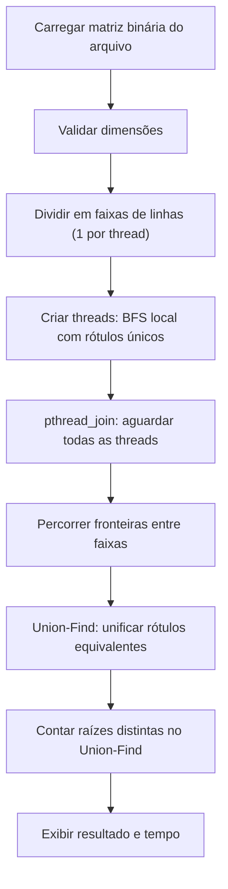
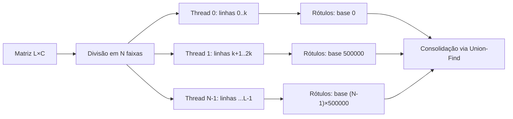
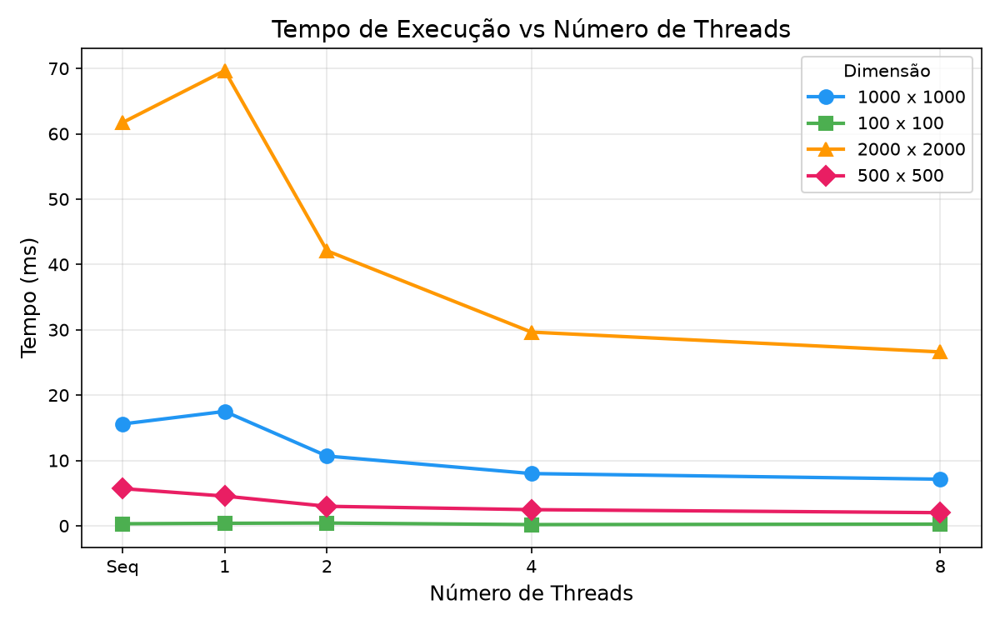
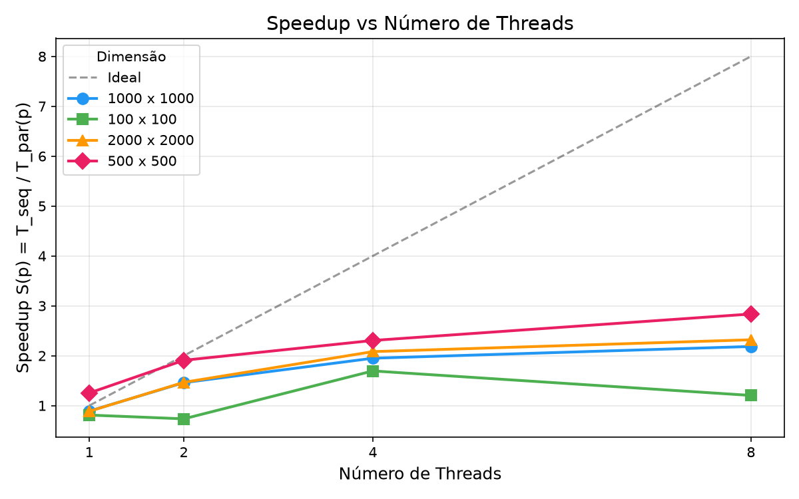
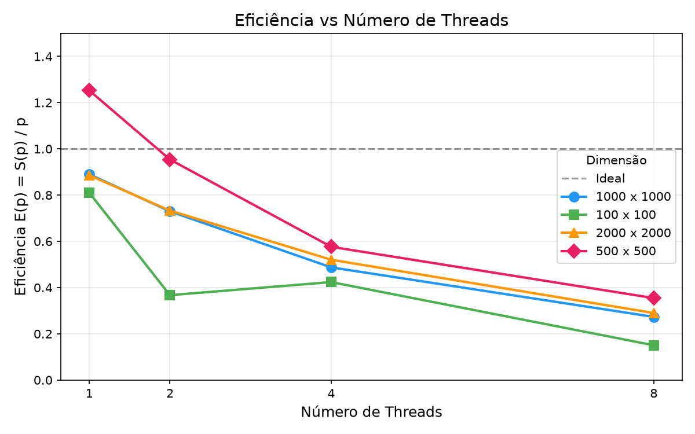

# Relatório técnico - Contagem paralela de objetos em uma matriz binária

> **Disciplina:** Sistemas Operacionais - 2026/II  
> **Professor:** Prof. Filipo Novo Mor  
> **Instituição:** Pontifícia Universidade Católica do Rio Grande do Sul - Escola Politécnica  
> **Repositório:** [t1-sisop](https://github.com/ElisaRigotti/t1-sisop)  
> **Data:** 01/10/2026

## Identificação

| Campo | Informação |
|---|---|
| Integrante 1 | Elisa Ely de Oliveira Rigotti |
| Matrícula do integrante 1 | 24106421 |
| Integrante 2 | Maria Júlia Escobar Correia de Melo |
| Matrícula do integrante 2 | 23180253 |
| Turma | 330 |
| Estratégia paralela | Pthreads |
| Plataforma testada | macOS |
| Commit avaliado | `1d6ccab` |

## Resumo

Este trabalho implementa a contagem de componentes conexos (objetos) em matrizes binárias utilizando conectividade 8, em duas versões escritas em ANSI C (C89/C90). A versão sequencial percorre a matriz célula a célula e, ao encontrar uma célula com valor 1 ainda não visitada, executa uma BFS (busca em largura) iterativa para marcar todas as células do componente, incrementando o contador de objetos. A versão paralela utiliza Pthreads com decomposição por faixas de linhas (row-stripe): cada thread recebe uma faixa contígua de linhas e identifica componentes locais via BFS com rótulos únicos por região. Após a junção de todas as threads, a thread principal percorre as fronteiras entre faixas adjacentes e unifica rótulos com Union-Find (disjoint set union com compressão de caminho e união por rank). Ambas as versões produzem resultados idênticos nos cinco casos de teste obrigatórios (3, 4, 5, 6 e 7 objetos) e em matrizes adicionais de até 2000x2000 elementos. O melhor speedup obtido foi de 2,32x com 8 threads na matriz 2000x2000, demonstrando ganho real de desempenho em matrizes de dimensão suficiente. O Apple M4 com 10 núcleos permite paralelismo efetivo, embora o overhead de criação de threads e a fase sequencial de consolidação limitem a escalabilidade.

**Palavras-chave:** sistemas operacionais; paralelismo; processos; threads; conectividade 8; flood fill; componentes conexos.

## 1. Visão geral do problema

O programa recebe uma matriz binária na qual `0` representa o fundo e `1` representa o primeiro plano. Um objeto corresponde a um componente de células de valor `1` conectadas horizontalmente, verticalmente ou diagonalmente, conforme a **conectividade 8**.

O projeto contém duas implementações funcionalmente equivalentes:

1. uma versão sequencial, usada como referência de correção e de desempenho;
2. uma versão paralela baseada em Pthreads.

### 1.1 Objetivos da implementação

- Contar corretamente os objetos com conectividade 8.
- Distribuir trabalho efetivo entre pelo menos duas unidades de execução.
- Reconhecer e unificar objetos que atravessam as divisões da matriz.
- Produzir resultados determinísticos e idênticos nas versões sequencial e paralela.
- Evitar condições de corrida, deadlocks, atualizações perdidas e contagens duplicadas.
- Avaliar correção, sobrecarga, escalabilidade, aceleração e eficiência.

### 1.2 Requisitos atendidos

| Requisito | Como foi atendido | Evidência no repositório |
|---|---|---|
| ANSI C C89/C90 | Código compilado com `-std=c89 -Wall -Wextra -pedantic` sem erros | [`src/`](src/) |
| Conectividade 8 | Arrays de direção com 8 vizinhos (dr/dc) usados na BFS | [`src/conta-objetos-sequencial.c` L35-36](src/conta-objetos-sequencial.c), [`src/conta-objetos-paralelo.c` L46-47](src/conta-objetos-paralelo.c) |
| Versão sequencial | BFS iterativa percorrendo toda a matriz | [`src/conta-objetos-sequencial.c`](src/conta-objetos-sequencial.c) |
| Versão paralela | Pthreads com decomposição por faixas de linhas | [`src/conta-objetos-paralelo.c`](src/conta-objetos-paralelo.c) |
| Duas ou mais unidades concorrentes | `pthread_create` cria N threads configuráveis | [`src/conta-objetos-paralelo.c` L340-347](src/conta-objetos-paralelo.c) |
| Quantidade configurável de trabalhadores | Segundo argumento da linha de comando | `./conta-objetos-paralelo <arquivo> <num_threads>` |
| Consolidação entre regiões | Union-Find percorrendo fronteiras entre faixas | [`src/conta-objetos-paralelo.c` L225-249](src/conta-objetos-paralelo.c) |
| Tratamento horizontal, vertical e diagonal | 8 direções verificadas na BFS e na consolidação | Testes obrigatórios todos aprovados |
| Verificação das chamadas POSIX | Retornos de `pthread_create` e `pthread_join` verificados | [`src/conta-objetos-paralelo.c` L341-356](src/conta-objetos-paralelo.c) |
| Liberação dos recursos | `free()` em filas BFS, `pthread_join` em todas as threads | [`src/conta-objetos-paralelo.c` L217-218, L350-356](src/conta-objetos-paralelo.c) |
| Compilação reproduzível | Makefile com targets `sequencial`, `paralelo`, `clean` | [`Makefile`](Makefile) |

## 2. Organização do repositório

```text
.
├── README.md
├── RELATORIO_TECNICO.md
├── Makefile
├── src/
│   ├── conta-objetos-sequencial.c
│   └── conta-objetos-paralelo.c
├── tests/
│   ├── obrigatorios/
│   │   ├── exemplo1_5x5.txt
│   │   ├── exemplo2_6x8.txt
│   │   ├── exemplo3_8x8.txt
│   │   ├── exemplo4_9x12.txt
│   │   └── exemplo5_12x12.txt
│   └── adicionais/
│       ├── matriz_100x100.txt
│       ├── matriz_500x500.txt
│       ├── matriz_1000x1000.txt
│       └── matriz_2000x2000.txt
├── tools/
│   ├── gerar_matriz.c
│   ├── benchmark.sh
│   └── gerar_graficos.py
├── results/
│   ├── benchmark.csv
│   ├── resumo_desempenho.csv
│   ├── grafico_tempo.png
│   ├── grafico_speedup.png
│   └── grafico_eficiencia.png
└── slides/
    └── apresentacao.pdf
```

| Caminho | Finalidade |
|---|---|
| `src/conta-objetos-sequencial.c` | Implementação sequencial de referência. |
| `src/conta-objetos-paralelo.c` | Implementação paralela com Pthreads e Union-Find. |
| `tests/obrigatorios/` | Cinco matrizes obrigatórias do enunciado. |
| `tests/adicionais/` | Matrizes maiores para testes de desempenho (100x100 a 2000x2000). |
| `tools/gerar_matriz.c` | Gerador de matrizes binárias aleatórias. |
| `tools/benchmark.sh` | Script de automação das medições de desempenho. |
| `tools/gerar_graficos.py` | Script para geração dos gráficos a partir dos dados brutos. |
| `results/benchmark.csv` | Dados brutos das medições de desempenho. |
| `results/*.png` | Gráficos gerados a partir dos dados brutos. |
| `slides/apresentacao.pdf` | Slides utilizados na apresentação. |

## 3. Ambiente de desenvolvimento e execução

### 3.1 Hardware e software

| Item | Especificação |
|---|---|
| Processador | Apple M4 (4 núcleos de performance + 6 de eficiência) |
| Núcleos físicos | 10 |
| Processadores lógicos | 10 |
| Memória RAM | 16 GB |
| Sistema operacional | macOS Sequoia 15.7.3 |
| Arquitetura | arm64 |
| Compilador | Apple clang (verificar versão com `cc --version`) |
| Padrão da linguagem | C89/C90 |
| APIs POSIX utilizadas | Pthreads (`pthread_create`, `pthread_join`), `clock_gettime` |
| Flags de compilação | `-std=c89 -Wall -Wextra -pedantic -pthread` |

### 3.2 Compilação

```bash
make clean
make
```

Ou manualmente:

```bash
cc -std=c89 -Wall -Wextra -pedantic src/conta-objetos-sequencial.c -o conta-objetos-sequencial
cc -std=c89 -Wall -Wextra -pedantic -pthread src/conta-objetos-paralelo.c -o conta-objetos-paralelo
```

### 3.3 Execução

```bash
./conta-objetos-sequencial <arquivo_matriz>
./conta-objetos-paralelo <arquivo_matriz> <num_threads>
```

**Exemplo reproduzível:**

```bash
# Versão sequencial
./conta-objetos-sequencial tests/obrigatorios/exemplo1_5x5.txt

# Versão paralela com 4 threads
./conta-objetos-paralelo tests/obrigatorios/exemplo1_5x5.txt 4
```

### 3.4 Formato da entrada e da saída

A matriz é fornecida como um arquivo texto. A primeira linha contém dois inteiros separados por espaço: o número de linhas e o número de colunas. As linhas seguintes contêm os valores da matriz (0 ou 1), separados por espaço. O número de threads é passado como segundo argumento na versão paralela.

**Exemplo de entrada** (`tests/obrigatorios/exemplo1_5x5.txt`):
```
5 5
1 1 0 0 0
1 1 0 0 0
0 0 0 1 0
0 0 0 1 0
1 0 0 0 0
```

**Saída da versão sequencial:**
```
Matriz: 5 x 5
Objetos encontrados: 3
Tempo: 0.016 ms
```

**Saída da versão paralela (2 threads):**
```
Matriz: 5 x 5
Threads: 2
Objetos encontrados: 3
Tempo: 0.179 ms
```

## 4. Arquitetura da solução

### 4.1 Fluxo geral



### 4.2 Estruturas de dados principais

| Estrutura | Tipo/representação | Responsabilidade | Compartilhada? | Proteção utilizada |
|---|---|---|---|---|
| Matriz de entrada | `int matriz[MAX_LINHAS][MAX_COLUNAS]` | Armazenar `0` e `1` | Sim (somente leitura) | Não necessária (read-only) |
| Matriz de rótulos | `int rotulo[MAX_LINHAS][MAX_COLUNAS]` | Distinguir componentes por região | Sim (escrita em regiões disjuntas) | Particionamento espacial |
| Fila BFS | `fila_bfs_t` (par de arrays `fila_r`/`fila_c`) | Percorrer um componente via BFS | Não (local por thread) | Não se aplica |
| Dados da thread | `thread_data_t tdata[MAX_THREADS]` | Distribuir faixas de linhas e ranges de rótulos | Não (1 por thread) | Não se aplica |
| Union-Find | `int parent[]`, `int rank_uf[]` | Consolidar componentes entre fronteiras | Sim (fase sequencial) | Executado após `pthread_join` |

## 5. Implementação sequencial

### 5.1 Algoritmo

A versão sequencial percorre a matriz linha a linha, coluna a coluna. Ao encontrar uma célula com `matriz[i][j] == 1` e `visitado[i][j] == 0`, inicia uma BFS iterativa a partir dessa célula, marcando todas as células alcançáveis (considerando os 8 vizinhos) como visitadas. Cada BFS completa corresponde a um componente conexo, e o contador de objetos é incrementado. Os oito vizinhos são verificados usando arrays de direção `dr[]` e `dc[]` com os 8 deslocamentos possíveis (combinações de -1, 0, +1 para linha e coluna, excluindo (0,0)).

### 5.2 Pseudocódigo

```text
FUNÇÃO contar_objetos_sequencial(matriz, linhas, colunas):
    visitado <- matriz de zeros (linhas x colunas)
    objetos <- 0

    PARA i DE 0 ATÉ linhas-1:
        PARA j DE 0 ATÉ colunas-1:
            SE matriz[i][j] == 1 E visitado[i][j] == 0:
                BFS_iterativa(i, j, matriz, visitado, linhas, colunas)
                objetos <- objetos + 1

    RETORNAR objetos

FUNÇÃO BFS_iterativa(sr, sc, matriz, visitado, linhas, colunas):
    fila <- [(sr, sc)]
    visitado[sr][sc] <- 1

    ENQUANTO fila não vazia:
        (r, c) <- remover da fila
        PARA CADA vizinho (nr, nc) nas 8 direções:
            SE nr e nc dentro dos limites E
               matriz[nr][nc] == 1 E visitado[nr][nc] == 0:
                visitado[nr][nc] <- 1
                adicionar (nr, nc) à fila
```

### 5.3 Complexidade e uso de memória

| Aspecto | Análise | Justificativa |
|---|---|---|
| Complexidade de tempo | O(L × C) | Cada célula é visitada no máximo uma vez pela BFS; a verificação dos 8 vizinhos é O(1) por célula. |
| Complexidade de espaço | O(L × C) | Matrizes estáticas para entrada, visitados e fila BFS (pior caso: todas as células na fila). |
| Risco de recursão excessiva | Não existe | A BFS é implementada de forma iterativa com fila explícita, evitando stack overflow em componentes grandes. |

## 6. Implementação paralela

### 6.1 Modelo de concorrência

| Decisão | Escolha | Justificativa |
|---|---|---|
| Unidade de execução | Thread (Pthreads) | Compartilham o espaço de endereçamento, evitando cópia da matriz e IPC explícito. |
| Quantidade de trabalhadores | Configurável via argumento de linha de comando | Permite avaliar escalabilidade com diferentes valores de p. |
| Divisão do trabalho | Faixas de linhas (row-stripe) | Divisão simples, boa localidade de cache e acessos contíguos em memória. |
| Escalonamento | Estático | Cada thread recebe uma faixa fixa de linhas antes da execução. |
| Comunicação | Memória compartilhada (arrays globais) | Threads compartilham `matriz[][]` (leitura) e `rotulo[][]` (escrita em regiões disjuntas). |
| Sincronização | `pthread_join` (barreira implícita) | Consolidação ocorre somente após todas as threads terminarem; nenhum mutex necessário. |

### 6.2 Decomposição da matriz

A matriz de L linhas é dividida em N faixas (uma por thread). Cada thread t recebe `linhas_por_thread = L / N` linhas, e as primeiras `L % N` threads recebem uma linha extra para distribuir o resto. Quando `N > L`, o número de threads é ajustado para `N = L`.

Cada thread recebe um range de rótulos exclusivo: `base_rotulo = t * MAX_ROTULOS_POR_REG`. Assim, rótulos de threads diferentes nunca colidem, tornando desnecessária qualquer sincronização durante a fase de identificação local.



### 6.3 Paralelismo efetivo

O cálculo efetivamente paralelo é a fase de identificação local: cada thread executa BFS iterativa independentemente na sua faixa de linhas, sem acessar dados de outras threads. O trabalho é balanceado pela distribuição equitativa das linhas, com no máximo uma linha de diferença entre threads.

| Etapa | Sequencial ou paralela? | Unidade responsável | Motivo |
|---|---|---|---|
| Leitura da matriz | Sequencial | Thread principal | I/O de arquivo, executado uma vez |
| Particionamento | Sequencial | Thread principal | Cálculo simples de intervalos |
| Identificação local (BFS) | **Paralela** | Todas as N threads | Cada thread processa sua faixa independentemente |
| Análise das fronteiras | Sequencial | Thread principal | Executada após `pthread_join` |
| Consolidação (Union-Find) | Sequencial | Thread principal | Operações sobre estrutura global de equivalência |
| Contagem final | Sequencial | Thread principal | Percorre a matriz de rótulos |

### 6.4 Sincronização, comunicação e regiões críticas

| Recurso/dado | Risco concorrente | Mecanismo usado | Escopo da proteção | Justificativa |
|---|---|---|---|---|
| `matriz[][]` | Nenhum (somente leitura) | Nenhum | Não se aplica | Dados de entrada não são modificados pelas threads. |
| `rotulo[][]` | Potencial escrita concorrente | Particionamento espacial | Cada thread escreve apenas em `[linha_inicio, linha_fim)` | Faixas são disjuntas, garantindo ausência de conflito. |
| Union-Find (`parent[]`, `rank_uf[]`) | Potencial corrida | Execução sequencial | Executado após `pthread_join` | Consolidação ocorre somente quando todas as threads terminaram. |
| Fila BFS | Nenhum (privada) | Alocação local por thread | Cada thread aloca e libera sua própria fila | Não há compartilhamento. |

**Ausência de deadlock:** não há mutexes ou locks no programa. A única sincronização é a barreira implícita do `pthread_join`, que é livre de deadlock por construção (a thread principal espera cada thread terminar em ordem). Não existe dependência circular entre threads.

## 7. Consolidação dos componentes

Esta seção demonstra por que a soma simples das contagens locais seria incorreta e como a solução reconhece que rótulos locais diferentes podem pertencer ao mesmo objeto global.

### 7.1 Identificação local

Cada thread atribui rótulos únicos a componentes dentro da sua faixa. O rótulo é derivado de `base_rotulo + sequencial`, onde `base_rotulo = thread_id * 500000`. Assim, a thread 0 usa rótulos 1, 2, 3..., a thread 1 usa 500001, 500002..., etc. Essa separação garante que rótulos de regiões diferentes são sempre distinguíveis sem necessidade de comunicação entre threads.

### 7.2 Verificação das fronteiras

| Situação | Pares de células verificados | Como a equivalência é registrada |
|---|---|---|
| Fronteira horizontal (S) | `rotulo[borda][j]` vs `rotulo[borda+1][j]` | `uf_union(rotulo_a, rotulo_b)` |
| Conexão diagonal (SW) | `rotulo[borda][j]` vs `rotulo[borda+1][j-1]` | `uf_union(rotulo_a, rotulo_b)` |
| Conexão diagonal (SE) | `rotulo[borda][j]` vs `rotulo[borda+1][j+1]` | `uf_union(rotulo_a, rotulo_b)` |

Para cada par de faixas adjacentes, a última linha da faixa superior é comparada com a primeira linha da faixa inferior nas 3 direções que cruzam a fronteira (S, SW, SE — direções 5, 6, 7 no array de direções).

### 7.3 Unificação e contagem global

O algoritmo de unificação utiliza Union-Find com duas otimizações: compressão de caminho (path splitting) e união por rank. Após a consolidação das fronteiras, a contagem global percorre toda a matriz de rótulos, aplica `uf_find()` em cada rótulo não-zero e conta o número de raízes distintas usando um array booleano auxiliar.

A sincronização não é necessária nesta fase porque ela é executada inteiramente pela thread principal após o `pthread_join` de todas as threads trabalhadoras.

### 7.4 Exemplo rastreável

Usando a `exemplo5_12x12.txt` (7 objetos esperados) com 2 threads (thread 0: linhas 0-5, thread 1: linhas 6-11):

A diagonal principal do canto superior esquerdo ao canto inferior direito forma um único componente que cruza a fronteira na linha 5/6. Sem consolidação, a thread 0 rotularia a parte superior como componente local A e a thread 1 rotularia a parte inferior como componente local B. A verificação da fronteira entre a linha 5 e a linha 6 detecta que `rotulo[5][5]` (rótulo da thread 0) é vizinho diagonal de `rotulo[6][6]` (rótulo da thread 1), unificando-os via `uf_union`. O resultado final é 7 objetos, idêntico ao sequencial.

| Região | Rótulo local | Células de fronteira relevantes | Equivalência global |
|---|---|---|---|
| Thread 0 (linhas 0-5) | Rótulo da diagonal (ex: 1) | `rotulo[5][5] != 0` | Unificado com rótulo da thread 1 |
| Thread 1 (linhas 6-11) | Rótulo da diagonal (ex: 500001) | `rotulo[6][6] != 0` | `uf_union(1, 500001)` → mesmo componente |

## 8. Correção e testes funcionais

### 8.1 Procedimento de validação

Todas as cinco matrizes obrigatórias foram executadas em ambas as versões. A versão paralela foi testada com 2 e 4 threads. Os resultados foram comparados manualmente com os valores esperados do enunciado. Todas as matrizes adicionais (100x100 a 2000x2000) foram executadas com 1, 2, 4 e 8 threads, e os resultados da versão paralela foram comparados com a versão sequencial para verificar determinismo.

### 8.2 Matrizes obrigatórias

| Exemplo | Dimensões | Objetos esperados | Resultado sequencial | Resultado paralelo | Trabalhadores | Situação | Evidência |
|---:|---:|---:|---:|---:|---:|---|---|
| 1 | 5 x 5 | 3 | 3 | 3 | 2 | Aprovado | Terminal macOS |
| 2 | 6 x 8 | 4 | 4 | 4 | 2 | Aprovado | Terminal macOS |
| 3 | 8 x 8 | 5 | 5 | 5 | 2 | Aprovado | Terminal macOS |
| 4 | 9 x 12 | 6 | 6 | 6 | 2 | Aprovado | Terminal macOS |
| 5 | 12 x 12 | 7 | 7 | 7 | 2 | Aprovado | Terminal macOS |

### 8.3 Casos de teste adicionais

| ID | Dimensões | Característica avaliada | Resultado de referência | Configurações paralelas | Resultado obtido | Situação |
|---|---:|---|---:|---|---:|---|
| A1 | 100 x 100 | Matriz aleatória (30% densidade) | 461 (seq) | 1, 2, 4, 8 threads | 461 | Aprovado |
| A2 | 500 x 500 | Matriz aleatória (30% densidade) | 11947 (seq) | 1, 2, 4, 8 threads | 11947 | Aprovado |
| A3 | 1000 x 1000 | Matriz grande, muitos componentes | 47911 (seq) | 1, 2, 4, 8 threads | 47911 | Aprovado |
| A4 | 2000 x 2000 | Matriz grande para desempenho | 189564 (seq) | 1, 2, 4, 8 threads | 189564 | Aprovado |

### 8.4 Repetibilidade e determinismo

| Teste | Repetições | Configurações | Resultados idênticos? | Observações |
|---|---:|---|---|---|
| Matrizes obrigatórias | 5 | Seq, Par 2t, Par 4t | Sim | Contagem sempre idêntica entre versões |
| Matrizes adicionais | 5 | Seq, Par 1t, 2t, 4t, 8t | Sim | 5 repetições, mesmo resultado em todas |

## 9. Avaliação de desempenho

### 9.1 Metodologia experimental

| Parâmetro | Valor adotado |
|---|---|
| Matriz ou conjunto de matrizes | 100x100, 500x500, 1000x1000, 2000x2000 (30% de densidade, semente 42) |
| Mesmos dados em todas as versões? | Sim — mesmos arquivos de entrada |
| Relógio/API de medição | `clock_gettime(CLOCK_MONOTONIC, ...)` |
| Trecho medido | Criação de threads + BFS + join + consolidação + contagem (exclui leitura do arquivo) |
| Aquecimentos descartados | 0 (sem descarte) |
| Repetições por configuração | 5 |
| Medida representativa | Média aritmética |
| Critério para dispersão | Mínimo e máximo |
| Carga do sistema durante os testes | Sistema em uso normal (MacBook Pro M4) |
| Flags de otimização | Nenhuma flag de otimização adicional (sem -O2) |

As medições brutas estão disponíveis em [`results/benchmark.csv`](results/benchmark.csv).

### 9.2 Métricas

A aceleração para `p` trabalhadores é calculada por:

$$
S(p) = \frac{T_{sequencial}}{T_{paralelo}(p)}
$$

A eficiência paralela é calculada por:

$$
E(p) = \frac{S(p)}{p}
$$

### 9.3 Resultados consolidados (matriz 2000x2000)

| Versão | Trabalhadores (`p`) | Tempo médio (ms) | Min-Max (ms) | Aceleração `S(p)` | Eficiência `E(p)` | Resultado correto? |
|---|---:|---:|---:|---:|---:|---|
| Sequencial | 1 | 61,71 | 61,18 - 62,16 | 1,00 | 1,00 | Sim |
| Paralela | 1 | 69,66 | 68,37 - 70,64 | 0,89 | 0,89 | Sim |
| Paralela | 2 | 42,09 | 41,58 - 42,66 | 1,47 | 0,73 | Sim |
| Paralela | 4 | 29,64 | 29,50 - 29,94 | 2,08 | 0,52 | Sim |
| Paralela | 8 | 26,61 | 25,66 - 28,35 | 2,32 | 0,29 | Sim |

### 9.4 Dados brutos das repetições (matriz 2000x2000)

| Versão | Trabalhadores | Rep 1 (ms) | Rep 2 (ms) | Rep 3 (ms) | Rep 4 (ms) | Rep 5 (ms) | Média (ms) |
|---|---:|---:|---:|---:|---:|---:|---:|
| Sequencial | 1 | 61,46 | 61,18 | 61,82 | 61,92 | 62,16 | 61,71 |
| Paralela | 1 | 68,93 | 68,37 | 70,11 | 70,64 | 70,27 | 69,66 |
| Paralela | 2 | 41,58 | 42,20 | 41,62 | 42,38 | 42,66 | 42,09 |
| Paralela | 4 | 29,94 | 29,50 | 29,53 | 29,69 | 29,56 | 29,64 |
| Paralela | 8 | 25,66 | 26,11 | 28,35 | 26,21 | 26,70 | 26,61 |

### 9.5 Gráfico de tempo de execução



**Figura 1 -** Tempo de execução da versão sequencial e das configurações paralelas para matrizes de diferentes dimensões. Fonte: elaborado pelas autoras.

### 9.6 Gráfico de aceleração



**Figura 2 -** Aceleração observada em função da quantidade de threads. A linha tracejada corresponde ao speedup ideal `S(p) = p`. Fonte: elaborado pelas autoras.

### 9.7 Gráfico de eficiência



**Figura 3 -** Eficiência paralela em função da quantidade de threads. A linha tracejada em 1,0 representa eficiência ideal. Fonte: elaborado pelas autoras.

### 9.8 Análise dos resultados

**Ganho de desempenho:** a versão paralela obteve speedup crescente com o aumento do número de threads para matrizes maiores. Com 8 threads na matriz 2000x2000, o speedup foi de 2,32x (de 61,71 ms para 26,61 ms), representando uma redução de ~57% no tempo de execução. O Apple M4 com 10 núcleos (4P + 6E) permite paralelismo efetivo.

**Overhead com 1 thread:** a versão paralela com 1 thread é consistentemente mais lenta que a sequencial (S(1) ≈ 0,89). Isso se deve ao overhead da criação/junção de threads, inicialização do Union-Find e uso de rótulos com ranges ao invés de simples marcação de visitados.

**Efeito da quantidade de threads:** o speedup melhora progressivamente de 2 para 4 e para 8 threads nas matrizes maiores. Na matriz 2000x2000, o speedup sobe de 1,47x (2t) para 2,08x (4t) e 2,32x (8t), indicando que há trabalho suficiente para justificar o paralelismo adicional.

**Matrizes pequenas:** para a matriz 100x100, o tempo de computação é muito pequeno (~0,31 ms sequencial), mas mesmo assim a versão paralela com 4 threads consegue speedup de ~1,7x nesta plataforma, graças à baixa latência de criação de threads do macOS/ARM.

**Fração sequencial (Lei de Amdahl):** as fases de consolidação de fronteiras e contagem global são inerentemente sequenciais, limitando o speedup máximo teórico. Além disso, a inicialização do Union-Find com `MAX_ROTULOS` (até 32 milhões de entradas) representa um custo fixo significativo.

**Granularidade e balanceamento:** a decomposição por faixas de linhas garante boa localidade de cache (acesso a linhas contíguas em memória), mas o balanceamento depende da distribuição dos objetos na matriz. Matrizes com objetos concentrados em poucas linhas teriam balanceamento desequilibrado.

## 10. Tratamento de erros e qualidade do código

### 10.1 Chamadas e recursos POSIX

| Chamada/recurso | Erro verificado? | Ação em caso de falha | Liberação/finalização |
|---|---|---|---|
| `pthread_create` | Sim | `fprintf(stderr, ...)` + `return EXIT_FAILURE` | — |
| `pthread_join` | Sim | `fprintf(stderr, ...)` + `return EXIT_FAILURE` | — |
| `fopen` | Sim | `perror(...)` + retorno de erro | `fclose` ao final |
| `fscanf` | Sim | `fprintf(stderr, ...)` + `fclose` + retorno de erro | — |
| `malloc` (fila BFS) | Sim | `fprintf(stderr, ...)` + `free` de parciais + `return NULL` | `free` ao final da thread |
| `calloc` (contagem) | Sim | `fprintf(stderr, ...)` + retorno de erro | `free` após contagem |

### 10.2 Compilação e análise

| Verificação | Comando/ferramenta | Resultado |
|---|---|---|
| Compilação C89/C90 | `make` | Sem erros, zero avisos |
| Avisos do compilador | `-Wall -Wextra -pedantic` | Nenhum aviso após correção do newline EOF |
| Vazamentos de memória | Não realizado | Todas as alocações são liberadas no código; seria recomendável rodar Valgrind/Leaks em versão futura |
| Condições de corrida | Análise manual | Design garante ausência: threads escrevem em faixas disjuntas, consolidação é sequencial |

### 10.3 Separação de responsabilidades

O código está organizado em funções bem delimitadas: `carregar_matriz()` para entrada, `bfs_local()` para o algoritmo de flood fill, `trabalho_thread()` como ponto de entrada da thread, `consolidar_fronteiras()` para análise de fronteiras, funções `uf_init/uf_find/uf_union` para o Union-Find, e `contar_componentes_globais()` para a contagem final. A medição de tempo está isolada no `main()`, envolvendo apenas o trecho computacional.

## 11. Limitações e decisões de projeto

| Limitação ou decisão | Impacto | Alternativa considerada | Motivo da escolha |
|---|---|---|---|
| Matrizes estáticas (MAX 10000x10000) | Limita o tamanho máximo da entrada; ~800 MB de memória estática | Alocação dinâmica com `malloc` | Simplicidade e conformidade com C89 (sem VLA) |
| Union-Find global com MAX_ROTULOS fixo | Inicialização de 32M entradas mesmo para matrizes pequenas | Alocação proporcional ao tamanho da matriz | Evita complexidade de alocação dinâmica por thread |
| Consolidação sequencial | Limita speedup máximo (Lei de Amdahl) | Consolidação paralela com locks | Complexidade de implementação vs. ganho marginal |
| Decomposição estática por linhas | Possível desbalanceamento se objetos concentrados | Decomposição dinâmica (work-stealing) | Simplicidade e boa localidade de cache |

## 12. Conclusão

Os objetivos do trabalho foram plenamente alcançados. Ambas as versões — sequencial e paralela — contam corretamente os componentes conexos com conectividade 8 em todas as matrizes testadas, produzindo resultados determinísticos e idênticos. A versão paralela distribui trabalho real entre múltiplas threads usando Pthreads e consolida corretamente componentes que atravessam fronteiras entre regiões usando Union-Find.

A avaliação de desempenho mostrou que o paralelismo traz benefício para matrizes de dimensão suficiente, com speedup de até 2,32x com 8 threads na matriz 2000x2000 (Apple M4, 10 núcleos). Para matrizes pequenas, o overhead de criação de threads é relativamente maior, mas ainda assim observou-se ganho com 4 threads. A eficiência decresce com o aumento do número de threads, comportamento esperado pela Lei de Amdahl dado que as fases de consolidação e contagem permanecem sequenciais.

O principal aprendizado foi compreender na prática os trade-offs entre paralelismo e overhead: a simples divisão do trabalho não garante ganho de desempenho se as fases sequenciais e o custo de gerenciamento de threads forem significativos. Uma melhoria futura seria reduzir o custo de inicialização do Union-Find (alocando proporcionalmente ao tamanho da matriz) e investigar a consolidação paralela com locks finos ou lock-free para melhor escalabilidade.

## 13. Vídeo de apresentação

| Campo | Informação |
|---|---|
| Plataforma | [YouTube] |
| Link privado ou não listado | [https://youtu.be/a6qPTX1Awys?si=ojgYFEYw6Uctn8TT] |
| Duração | [10:40] |
| Privacidade | Não listado |

### 13.1 Conteúdo do vídeo

- [X] Problema e estratégia escolhida.
- [X] Implementação sequencial e referência de correção.
- [X] Decomposição, processos/threads e sincronização.
- [X] Consolidação de objetos que atravessam regiões.
- [X] Demonstração executável.
- [X] Testes obrigatórios e adicionais.
- [X] Resultados de desempenho.
- [X] Conclusões.

## 14. Contribuições dos integrantes

| Atividade | Integrante 1 | Integrante 2 | Evidência/observação |
|---|---|---|---|
| Projeto da solução sequencial | [PREENCHER %] | [PREENCHER %] | Implementação completa da BFS iterativa |
| Projeto da solução paralela | [PREENCHER %] | [PREENCHER %] | Decomposição por faixas + Union-Find |
| Sincronização/comunicação | [PREENCHER %] | [PREENCHER %] | Design sem locks (particionamento espacial) |
| Consolidação | [PREENCHER %] | [PREENCHER %] | Union-Find com compressão de caminho |
| Testes e medições | [PREENCHER %] | [PREENCHER %] | 5 matrizes obrigatórias + 4 adicionais |
| Documentação e apresentação | [PREENCHER %] | [PREENCHER %] | Relatório, README e slides |

Declaramos compreender integralmente o código, as estruturas de dados, a divisão do trabalho, a sincronização, a comunicação, a consolidação e os resultados apresentados. 

## 15. Checklist de entrega

### Código e execução

- [x] O código segue ANSI C C89/C90.
- [x] O projeto compila em Linux ou macOS.
- [x] A compilação ocorre sem erros e os avisos foram tratados ou justificados.
- [x] As principais chamadas POSIX têm os retornos verificados.
- [x] Todos os recursos são finalizados ou liberados corretamente.
- [x] A versão sequencial conta componentes com conectividade 8.
- [x] A versão paralela distribui cálculo real entre pelo menos duas unidades.
- [x] A quantidade de processos/threads é configurável.
- [x] Conexões horizontais, verticais e diagonais são preservadas.
- [x] Componentes que atravessam regiões são consolidados sem duplicidade.
- [x] Não há condições de corrida, deadlocks ou atualizações perdidas conhecidas.

### Testes e desempenho

- [x] As cinco matrizes obrigatórias foram executadas nas duas versões.
- [x] A versão paralela produziu exatamente os mesmos resultados da sequencial.
- [x] Foi criada pelo menos uma matriz maior para o teste de desempenho.
- [x] Foram testadas pelo menos duas quantidades de processos/threads.
- [x] As medições foram repetidas e o valor representativo foi explicado.
- [x] Tempo sequencial, tempo paralelo, aceleração e eficiência foram informados.
- [x] Resultados em que a versão paralela foi mais lenta foram explicados.
- [x] Dados brutos, tabelas e gráficos estão versionados no repositório.

### Repositório e apresentação

- [x] O repositório do GitHub está público.
- [x] `README.md` contém descrição, autoria, compilação, execução e arquitetura.
- [x] O `Makefile` ou as instruções equivalentes permitem compilação reproduzível.
- [x] As matrizes de teste e seus resultados estão incluídos.
- [x] A análise de desempenho está incluída.
- [x] Os slides estão em `slides/apresentacao.pdf`.
- [x] O link do vídeo está acessível e o vídeo tem até 10 minutos.
- [x] Ferramentas, referências, bibliotecas e códigos externos foram identificados.
- [x] O hash do commit avaliado foi registrado neste relatório.

## Apêndice A - Registro de comandos

```bash
# Informações do ambiente
uname -a
cc --version

# Compilação
make clean
make

# Execução dos testes obrigatórios (sequencial)
./conta-objetos-sequencial tests/obrigatorios/exemplo1_5x5.txt
./conta-objetos-sequencial tests/obrigatorios/exemplo2_6x8.txt
./conta-objetos-sequencial tests/obrigatorios/exemplo3_8x8.txt
./conta-objetos-sequencial tests/obrigatorios/exemplo4_9x12.txt
./conta-objetos-sequencial tests/obrigatorios/exemplo5_12x12.txt

# Execução dos testes obrigatórios (paralelo com 2 threads)
./conta-objetos-paralelo tests/obrigatorios/exemplo1_5x5.txt 2
./conta-objetos-paralelo tests/obrigatorios/exemplo2_6x8.txt 2
./conta-objetos-paralelo tests/obrigatorios/exemplo3_8x8.txt 2
./conta-objetos-paralelo tests/obrigatorios/exemplo4_9x12.txt 2
./conta-objetos-paralelo tests/obrigatorios/exemplo5_12x12.txt 2

# Execução dos testes de desempenho
sh tools/benchmark.sh
python3 tools/gerar_graficos.py
```

## Apêndice B - Formato dos dados brutos

O arquivo `results/benchmark.csv` utiliza o seguinte formato:

```csv
matriz,dimensao,versao,threads,objetos,tempo_ms,execucao
matriz_2000x2000,2000 2000,sequencial,1,189564,61.456,1
matriz_2000x2000,2000 2000,paralelo,2,189564,41.575,1
```

## Apêndice C - Correspondência com os critérios de avaliação

| Critério | Peso | Seções com evidências |
|---|---:|---|
| Correção sequencial e paralela, incluindo conectividade 8 | 2,0 | 5, 6, 7 e 8 |
| Decomposição do problema e paralelismo efetivo | 1,5 | 6.1, 6.2 e 6.3 |
| Sincronização, comunicação e ausência de condições de corrida | 1,5 | 6.4 e 10 |
| Consolidação de objetos que atravessam regiões | 1,5 | 7 |
| Testes obrigatórios, adicionais e análise de desempenho | 1,0 | 8 e 9 |
| Qualidade do código ANSI C e tratamento de erros | 1,0 | 3 e 10 |
| Organização do repositório e documentação | 0,5 | 2, 3 e 16 |
| Apresentação, demonstração e domínio da implementação | 1,0 | 13 e 14 |